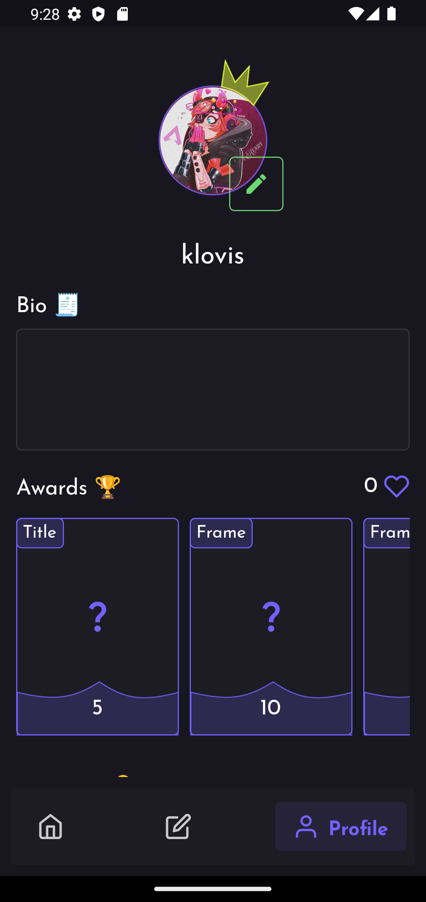
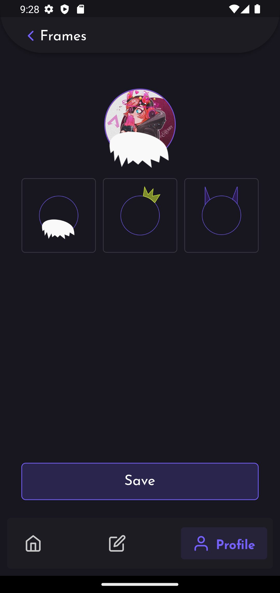
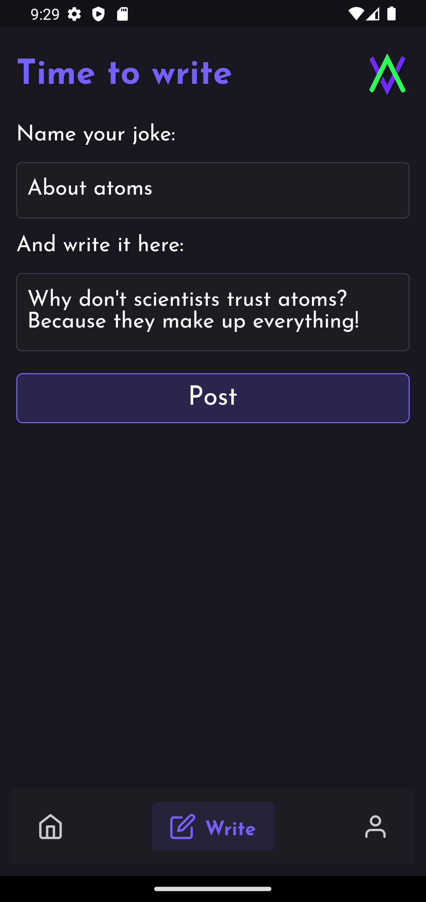
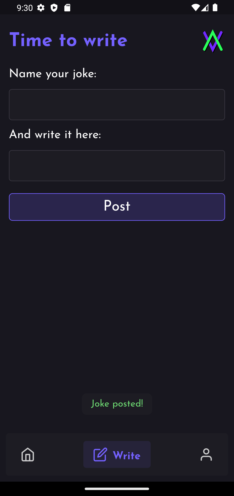
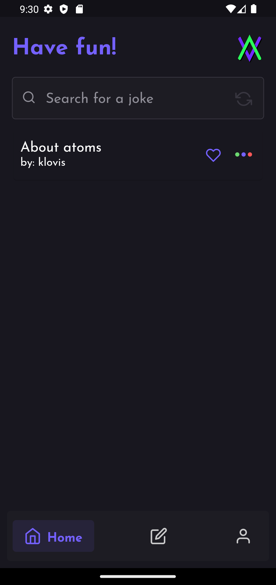
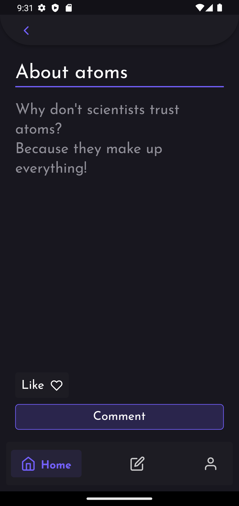

<h1 align="center">
    
</h1>

# Flugo

Joke-sharing app, made with Flutter

### Functionality:

```
👷‍♂️ Work in Progress 👷‍♂️
```

The app was developed for the world to share it's best jokes in verbal form. Here you can:

🤣 Share your jokes with the Flugo community

💖 Collect likes for your posted jokes and give your hearts to others!

✨ Acquire different awards to customize your profile!

### Screens

 






